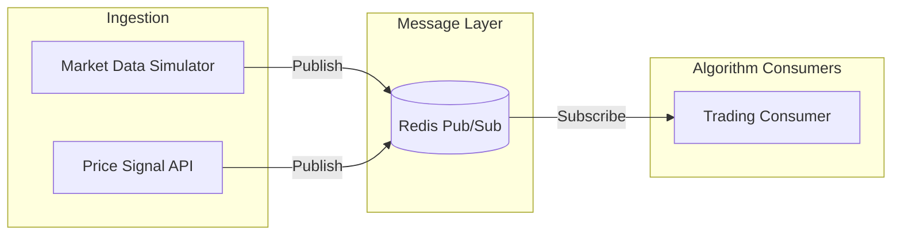

# Architecture

## Overview

The Energy Market Price Signal Router ingests electricity market price signals and routes them to trading algorithm consumers via a message-passing architecture. It mirrors production energy trading platforms such as Tesla Autobidder.

## Data Flow

## Components

### 1. Signal Ingestion Service

- **API** (`POST /prices`): Accepts external price signals, validates them, and publishes to Redis
- **Simulator**: Generates realistic day-ahead (DA) and real-time (RT) electricity prices with intraday patterns
- **Publisher**: Maps market type to Redis channel (`prices:day-ahead`, `prices:real-time`) and publishes

### 2. Message Layer (Redis)

- Uses Redis Pub/Sub for low-latency routing
- Channels: `prices:day-ahead`, `prices:real-time`
- Signals are serialized as JSON (Pydantic models)

### 3. Trading Consumer

- Subscribes to both price channels
- Runs arbitrage algorithm: charge when price < threshold_low, discharge when price > threshold_high, else hold
- Logs each decision with signal timestamp and action

## Design Decisions

| Decision | Rationale |
|----------|-----------|
| Redis Pub/Sub | Simple, fast, no persistence needed for real-time routing; can migrate to Redis Streams for at-least-once delivery |
| Separate channels per market | Allows consumers to subscribe only to markets they need |
| Pydantic models | Strong typing, validation, JSON serialization |
| Env-based config | Twelve-factor compatible, easy Docker/K8s integration |

## Configuration

| Variable | Default | Description |
|----------|---------|-------------|
| REDIS_HOST | localhost | Redis host |
| REDIS_PORT | 6379 | Redis port |
| THRESHOLD_LOW_CENTS | 20.0 | Price below which to charge |
| THRESHOLD_HIGH_CENTS | 80.0 | Price above which to discharge |
